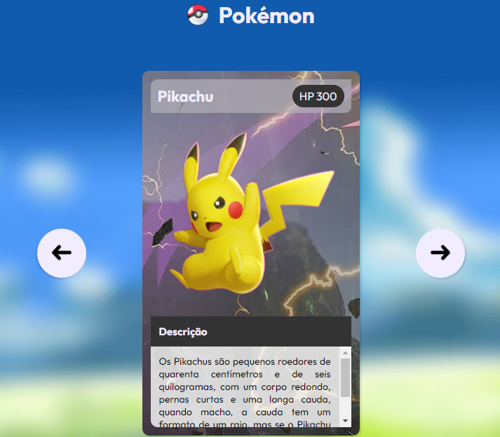

# Projeto Pokémon Slider

> Pokédex

## Índice

- [Imagem do Projeto](#imagem-do-projeto)
- [Repositório do Projeto](#repositório-do-projeto)
- [Tecnologias 💻](#tecnologias-💻)
- [Contato 📩](#contato-📩)

## Imagem do Projeto

Projeto de um carrossel de imagens de Pokémons, com descrição e HP de cada um, como uma Pokédex. As setas de avançar ou voltar levam ao próximo pokémon ou ao anterior, respectivamente. Ao chegar ao último pokémon e clicar na seta de avançar, volta-se ao primeiro.

## Repositório do Projeto

[🔗 Clique para acessar o projeto](https://github.com/alysson-leite/projeto-pokemon-slider)

## Tecnologias 💻

- HTML
- CSS
- Javascript
- Git e Github

## Contato 📩

[alysson_leite@yahoo.com.br](alysson_leite@yahoo.com.br)

[Linkedin](https://www.linkedin.com/in/alysson-leite-14040a239/)

[Repositórios Github](https://github.com/alysson-leite?tab=repositories)